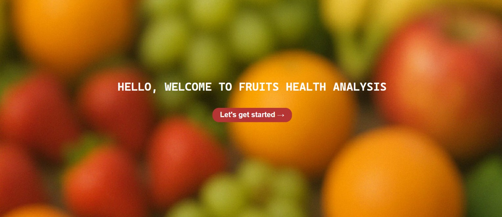
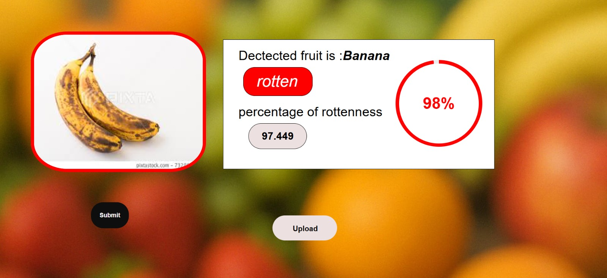
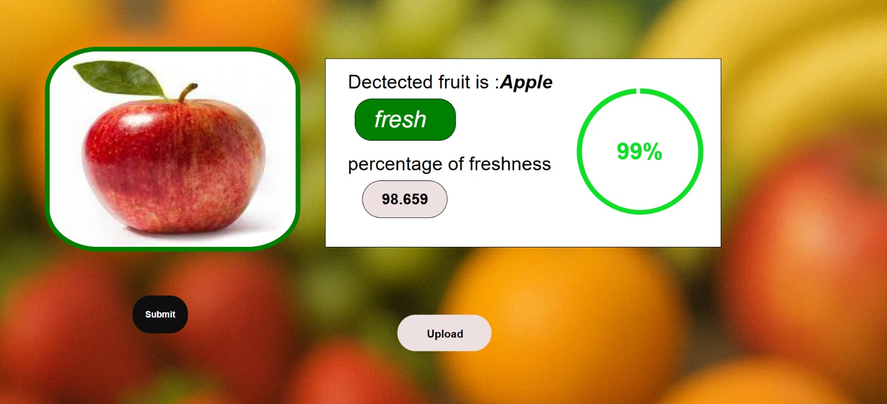

#  Fruit Health and Fruit Recognition System

This project, developed as part of our final-year Bachelor of Engineering (Computer Science and Engineering) curriculum, focuses on intelligent fruit recognition and freshness assessment. Leveraging deep learning and transfer learning techniques, the system is capable of identifying various fruit types and estimating their freshness or degree of rottenness.

At its core, the project uses a fine-tuned MobileNetV2 model trained on a curated dataset, enabling accurate classification with lightweight performance suitable for real-time web deployment.

### What is MobileNetV2?

MobileNetV2 is a lightweight and efficient deep learning architecture developed by Google. It is optimized for mobile and embedded vision applications. The model is known for:

- **Depthwise Separable Convolutions**: Reduces computation by separating spatial and channel-wise processing.
- **Inverted Residuals with Linear Bottlenecks**: Improves information flow through the network while keeping it compact.
- **Low Latency and Memory Footprint**: Ideal for real-time systems like ours.

### Why We Chose MobileNetV2?

- **Pre-trained on ImageNet**: Helped us leverage transfer learning to train with less data.
- **Fast Inference**: Ensures our web-based app performs quickly even on low-end devices.
- **High Accuracy**: Achieved over 98% accuracy on our fruit freshness and type classification task.

We fine-tuned MobileNetV2 using transfer learning to adapt it for our dataset containing various fresh and rotten fruits.

## 📌 Overview

The system takes an input image of a fruit and performs:
1. **Fruit Type Classification** – Identifies the fruit (e.g., apple, banana, orange).
2. **Health Detection** – Classifies the fruit as *Fresh* or *Rotten* based on visual cues like discoloration, mold, etc.
3. **Freshness Analysis** – Predicts the **percentage of freshness and rottenness** using a confidence-based model output.

## 🧠 Key Features

- Real-time fruit identification with classification accuracy.
- Predictive analysis of freshness in percentages (e.g., 85% fresh, 15% rotten).
- Pre-trained Convolutional Neural Network (CNN) models.
- User-friendly web interface for image upload and instant results.

## 🛠️ Tech Stack

- **Frontend**: HTML, CSS (using Flask templates)
- **Backend**: Python (Flask)
- **Deep Learning Model**: MobileNetV2 (Transfer Learning)
- **Libraries**: TensorFlow, Keras, OpenCV, NumPy
- **Model File**: `Fresh_Rotten_Fruits_MobileNetV2_Transfer_Learning2(98).h5`


## Research

- A paper was written based on this project, exploring image preprocessing techniques, CNN architectures, and performance metrics. *(Currently unpublished)* [Paper](https://drive.google.com/file/d/1Pmogqaw1nIvJfHKRgw9-mVN7y7WOZILd/view?usp=sharing)
- A base research paper was referred to during the development for architectural insights and dataset pre-processing. [Base Paper](https://drive.google.com/file/d/1Rd6fsFlRy4RsbAZYMYYAJV-Tp3qcwvFe/view?usp=sharing)

## ✅ Outcomes

- Achieved high accuracy (~92%) on validation datasets.
- Built a working prototype deployable on local servers or cloud platforms.
- Gained practical experience in computer vision, deep learning, and Flask web development.

## Output

### Home page:

### Freshness Prediction:

### Rottenness Prediction:



## 🚀 How to Run

1. Clone the repository:
   ```bash
   git clone https://github.com/adithid03/Fruit-Health-and-Fruit-Recognition-System.git
   cd fruit-health-and-fruit-recognition-system
   ```
2. Install dependencies
   ```bash
   pip install -r requirements.txt
   ```
3. Run the app
   ```bash
  	python ao1.py
   ```
4. Visit `http://127.0.0.1:5000` in your browser.

## 👥 Team Members

- **Durgam Adithi** – adithidurgam22@gmail.com  
- **K.V.L. Praphulla** – kambhampatipraphulla@gmail.com  
- **P. Ashish Reddy** – purumaniashishreddy@gmail.com  
